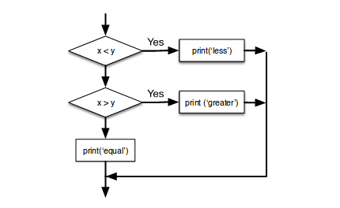

#  Conditional execution

## Boolean expressions

   * A boolean expression is an expression that is either true or false. 
  
```
>>>5 == 5
True
>>>5 == 6
False
```
True and False are special values that belong to the class bool ; they are not strings:
```
>>> type(True)
<class 'bool'>
>>> type(False)
< class 'bool'>
```

The == operator is one of the comparison operators ; the others are: 

```
    x != y      # x is not equal to y
    x > y       # x is greater than y
    x < y       # x is less than y
    x >= y      # x is greater than or equal to y
    x <= y      # x is less than or equal to y
    x is y      # x is the same as y 
    x is not y  # x is not the same as y

```

Logical operators:

```
and     or      is      not     in

```

```
eg:

x > 0 and x < 10

is true only if x is greater than 0 and less than 10

>>> 17 and True
True
```
## If statement
The if statement is a compound statement that enables us to conditionally execute blocks of code.

The syntax looks like
```
if expression:
    do this

```

```
if x > 0:
  print('x is positive')
```

The boolean expression after the if statement is called the condition . We end the if statement with a colon character (:) and the line(s) after the if statement are indented.




## Alternative execution(IF-ELSE)

A second form of the if statement is alternative execution , in which there are two possibilities and the condition determines which one gets executed. 
The syntax looks like this:
```
if x% 2 ==0 :
  print('x is even')
else:
  print('x is odd')
```


diagram-2

## Chained Condition(IF-ELIF-ELSE)

Sometimes there are more than two possibilities and we need more than two branches. One way to express a computation like that is a
chained conditional :

if x < y:
  print('x is less than y')
elif x > y:
  print('x is greater than y')
else:
  print('x and y are equal')

diagram-3

## Nested conditionals

One conditional can also be nested within another. We could have written the three-branch example like this:
```
if x == y:
  print('x and y are equal')
else:
  if x < y:
    print('x is less than y')
  else:
    print('x is greater than y')
```
diagram-4

